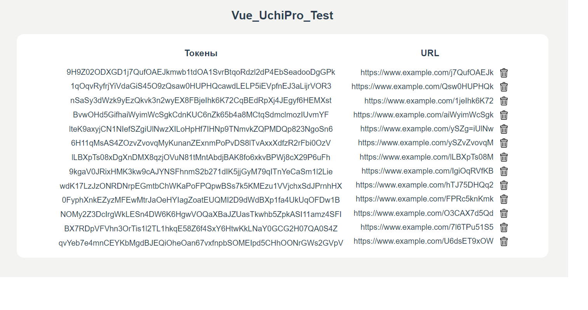

## Vue_UchiPro_Test

## Интерфейс для сервиса хранения токенов

Данный сервис позволяет обрабатывать запросы, приходящие от систем дистанционного обучения. Пользовательский интерфейс написан на Vue.js. Со стороны бэкенда 
реализован архитектурный подход REST API. Серверная часть написана на Node.js (фреймворк express.js), также в проекте работает СУБД MongoDB. Проект разделен на backend и frontend по причине того, что затруднен деплой бэка, сервисы не могут определить где в репозитории бэкенд, а где фронтенд.

## Хостинг

Проект развернут на площадке google Firebase и Heroku

Клиентская часть: https://vue-uchi-pro.web.app/

Сервепная часть: https://github.com/utkamag/Vue_UchiPro_Backend

## Технологический стек
Frontend:
- Vue.js
- Vuex

Backend:
- Node.js
- Express.js
- MongoDB
- Mongoose

## Зависимости:
Frontend: 
 - "axios": "^1.1.3",
 - "core-js": "^3.8.3",
 - "crypto-random-string": "^5.0.0",
 - "vue": "^3.2.13",
 - "vue-router": "^4.0.3",
 - "vuex": "^4.0.0"

 Backend: 
 - "express": "^4.18.2",
 - "mongoose": "^6.6.7"
 - "nodemon": "^2.0.20"
